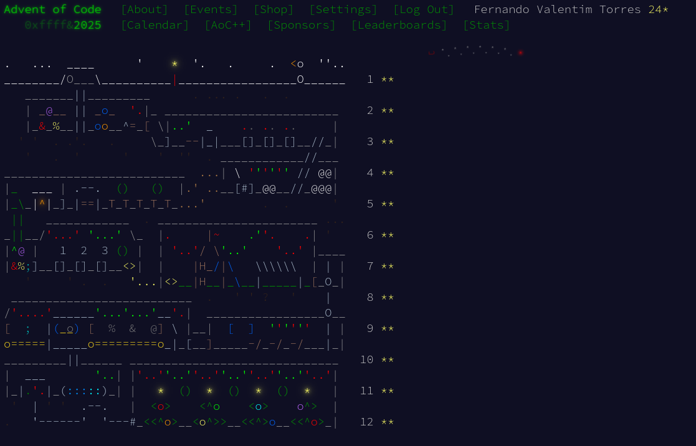

# AOC 2025

Nesse repositório irei resolver os 12 dias do Advent of Code 2025. Cada dia em uma linguagem diferente.

1. Clojure
2. C++
3. JavaScript
4. Java
5. Lua
6. Zig
7. Haskell
8. C#
9. Ada
10. Erlang
11. Go
12. Julia

